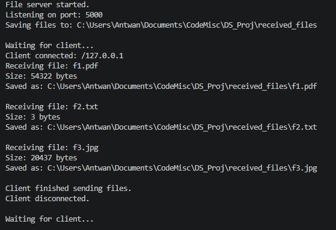
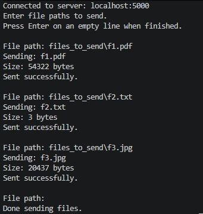

# File Server and Client Project

## Overview

This project consists of two Java files: `FileServer.java` and `FileClient.java`. Together, they implement a simple file server and client system. The server is responsible for handling file-related requests, while the client interacts with the server to perform operations such as uploading, downloading, or listing files.

## Components

### FileServer.java

The `FileServer.java` file contains the implementation of the server-side logic. It listens for incoming client connections and processes their requests. The server can handle operations such as:

- Receiving files from the client and saving them on the server.
- Sending requested files to the client.
- Providing a list of available files to the client.

### FileClient.java

The `FileClient.java` file contains the implementation of the client-side logic. It connects to the server and sends requests for file operations. The client can:

- Upload files to the server.
- Download files from the server.
- Request a list of files available on the server.

## How It Works

1. The server is started first, and it begins listening for client connections.
2. The client connects to the server and sends a request for a specific operation (e.g., upload, download, list files).
3. The server processes the request and sends the appropriate response back to the client.
4. The client handles the server's response and performs the necessary actions (e.g., saving a downloaded file).

## Usage

1. Compile both `FileServer.java` and `FileClient.java` using a Java compiler.
2. Start the server by running the `FileServer` class.
3. Run the `FileClient` class to interact with the server.

## Requirements

- Java Development Kit (JDK) installed.
- Both `FileServer.java` and `FileClient.java` should be in the same network or accessible to each other.

## Notes

- Ensure that the server has the necessary permissions to read/write files in its working directory.
- The client should specify the correct server address and port when connecting.

## Snapshots of Results

Below are snapshots of the results:

